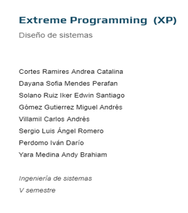

# PROYECTO ORGANIZACION-HORARIOS

## Objetivo

El objetivo de este proyecto es desarrollar una aplicación web que permita gestionar de manera eficiente los horarios de clases de una institución educativa. El sistema facilita la asignación de docentes, salones y horarios, evitando conflictos de horarios y mejorando la organización. Además, proporciona notificaciones automáticas a los profesores por correo electrónico y WhatsApp, permitiendo que reciban sus horarios de forma clara y oportuna.

## Problemática

La institución educativa enfrenta problemas para organizar los horarios de clases debido al uso de hojas de cálculo. Este método no les permite llevar un buen control sobre las horas de trabajo de los profesores, los salones disponibles ni las asignaturas asignadas, lo que genera conflictos de horarios y una gestión ineficiente. Esta situación causa confusión tanto para los profesores como para los encargados de la administración y provoca una considerable pérdida de tiempo.

## Solución

El sistema proporcionará una página web que permitirá a los encargados gestionar de forma eficiente los horarios de clases, tomando en cuenta la disponibilidad de los salones, los horarios de los docentes y sus roles contractuales. El sistema enviará los horarios a los profesores por correo electrónico y WhatsApp, asegurando que la información sea clara y fácilmente accesible. Además, se podrán exportar e imprimir los horarios en formato PDF. Los salones ocupados no podrán ser asignados a otros profesores en el mismo bloque de tiempo, y se verificará que tanto el profesor como el salón estén disponibles antes de hacer la asignación.

## Requerimientos Funcionales

- **RF1: Gestión de Profesores y Carga Académica**
  - **Historia de Usuario**: El responsable del programa debe poder gestionar la carga académica de los profesores, considerando los diferentes tipos de contratos (TC-40, MT-26, C-16).
  - **Criterios de Aceptación**: El sistema debe permitir ingresar la información de los profesores, calcular automáticamente sus horas de trabajo según su contrato y actualizar la carga horaria en tiempo real.
  - **Prioridad**: Alta

- **RF2: Gestión de Aulas y Bloques Horarios**
  - **Historia de Usuario**: El responsable del programa debe poder asignar aulas por bloques de tiempo, evitando conflictos de horarios.
  - **Criterios de Aceptación**: El sistema debe permitir la asignación manual o automática de aulas (A, B, C, con capacidad para 30 estudiantes), verificando que no estén ocupadas en el mismo horario.
  - **Prioridad**: Alta

- **RF3: Asignación de Horarios y Prevención de Solapamientos**
  - **Historia de Usuario**: El responsable del programa debe poder asignar los horarios de los docentes de acuerdo con su disponibilidad, evitando solapamientos o sobrecargas horarias.
  - **Criterios de Aceptación**: Asignación automática de horarios basada en la disponibilidad de los profesores y aulas, evitando conflictos con otras clases.
  - **Prioridad**: Alta

- **RF4: Gestión de Asignaturas**
  - **Historia de Usuario**: El responsable del programa debe poder organizar las asignaturas y asignarlas a los docentes para su planificación.
  - **Criterios de Aceptación**: El sistema debe permitir gestionar las asignaturas y vincularlas con profesores y aulas disponibles.
  - **Prioridad**: Alta

- **RF5: Exportación e Impresión de Horarios**
  - **Historia de Usuario**: El responsable del programa debe poder exportar los horarios en un formato adecuado para impresión o distribución.
  - **Criterios de Aceptación**: El sistema debe permitir la exportación de horarios en formato PDF para su impresión.
  - **Prioridad**: Media

- **RF6: Envío de Horarios por Correo Electrónico y WhatsApp**
  - **Historia de Usuario**: Los profesores deben recibir automáticamente sus horarios a través de correo electrónico o WhatsApp.
  - **Criterios de Aceptación**: El sistema debe enviar los horarios de forma automática, garantizando la recepción.
  - **Prioridad**: Media

- **RF7: Notificaciones Automáticas**
  - **Historia de Usuario**: Los profesores deben ser notificados automáticamente si hay cambios o actualizaciones en sus horarios.
  - **Criterios de Aceptación**: Notificación automática por correo electrónico o WhatsApp cuando se realicen modificaciones en los horarios.
  - **Prioridad**: Alta

## Requerimientos No Funcionales

- **RNF1: Seguridad y Protección de Datos**
  - **Descripción**: Asegurar la protección de la información y evitar accesos no autorizados.
  - **Criterios de Evaluación**: Implementar autenticación robusta, cifrado de datos en tránsito y en reposo, y una adecuada gestión de permisos de usuarios.
  - **Prioridad**: Alta

- **RNF2: Escalabilidad y Rendimiento**
  - **Descripción**: Garantizar que el sistema pueda manejar un mayor número de usuarios y operaciones sin afectar el rendimiento.
  - **Criterios de Evaluación**: Evaluación de la capacidad del sistema para gestionar múltiples solicitudes simultáneas y optimización de bases de datos.
  - **Prioridad**: Alta

- **RNF3: Usabilidad y Experiencia de Usuario**
  - **Descripción**: Proveer una interfaz intuitiva que funcione adecuadamente en diferentes dispositivos.
  - **Criterios de Evaluación**: Realización de pruebas de usabilidad, diseño adaptable (responsive) y accesibilidad en la navegación.
  - **Prioridad**: Media

- **RNF4: Alta Disponibilidad**
  - **Descripción**: Asegurar que el sistema esté disponible casi en todo momento, minimizando tiempos de inactividad.
  - **Criterios de Evaluación**: Implementación de estrategias de alta disponibilidad y planificación de mantenimientos en horas de bajo uso.
  - **Prioridad**: Alta

- **RNF5: Soporte Técnico y Actualizaciones**
  - **Descripción**: Proveer un plan de soporte técnico y actualizaciones constantes del sistema.
  - **Criterios de Evaluación**: Disponibilidad de soporte técnico para resolver problemas y procedimientos para actualizaciones periódicas.
  - **Prioridad**: Media
  
## Levantamiento de Requerimientos

En XP, el levantamiento de los requerimientos es un proceso iterativo y colaborativo. El cliente (en este caso, el director del programa) trabaja de la mano con el equipo de desarrollo para crear **historias de usuario**, que describen las necesidades del sistema desde la perspectiva del usuario final. Estas historias se priorizan y se desarrollan en ciclos cortos, permitiendo la entrega continua de valor.

### Proceso:

1. **Reuniones frecuentes**: El equipo de desarrollo y el cliente se reúnen regularmente para definir, aclarar y priorizar las historias de usuario.
2. **Historias de usuario detalladas**: Se documentan las funciones requeridas por el cliente de forma sencilla y comprensible.
3. **Iteraciones rápidas**: Se trabaja en ciclos cortos donde se implementan las historias de usuario más prioritarias.
4. **Retroalimentación continua**: El cliente revisa el software al final de cada iteración, permitiendo ajustes o cambios según lo requerido.

## Ceremonias en XP

XP utiliza una serie de ceremonias para mantener al equipo enfocado en la entrega de valor y en la mejora continua. Las principales ceremonias son:

1. **Planning Game**: Es el momento en que el equipo y el cliente se reúnen para planificar las historias de usuario que se implementarán en la próxima iteración. Se identifican las prioridades y el equipo estima el esfuerzo necesario.
   
2. **Stand-ups**: Reuniones diarias cortas donde cada miembro del equipo comparte su progreso, dificultades y planes para el día. Estas reuniones permiten detectar obstáculos y coordinar esfuerzos.

3. **Pair Programming**: Dos desarrolladores trabajan juntos en una misma estación de trabajo. Uno escribe el código mientras el otro lo revisa en tiempo real, asegurando alta calidad en la implementación.

4. **Continuous Integration (CI)**: El código se integra de forma continua al sistema principal, lo que permite detectar rápidamente errores de integración y garantizar la coherencia del proyecto.

5. **Retrospectivas**: Después de cada iteración, el equipo reflexiona sobre lo que funcionó bien y lo que debe mejorar. Esta práctica permite ajustar los procesos y mejorar continuamente.

## Actores Clave en XP

En XP, los roles clave son más flexibles y colaborativos que en otras metodologías. Los actores principales son:

- **Cliente (Director del programa)**: Participa activamente en el desarrollo del proyecto. Define los requerimientos, prioriza las funcionalidades y da retroalimentación constante sobre los avances.
  
- **Equipo de Desarrollo**: Encargado de la implementación de las historias de usuario. Trabaja de manera colaborativa y en pares, asegurando la calidad del código y la entrega de valor continuo.

- **Coach**: El coach se encarga de guiar al equipo en la implementación correcta de las prácticas de XP, asegurándose de que se mantenga el enfoque en los valores y principios de la metodología.

- **Tracker**: Este rol supervisa el progreso del proyecto y se asegura de que el equipo cumpla con los tiempos estimados, ayudando a identificar obstáculos que puedan retrasar las entregas.

## Valores Fundamentales de XP

En el desarrollo de este proyecto, nos guiamos por los valores fundamentales de **Extreme Programming (XP)** para asegurar la calidad y efectividad del sistema. Estos valores son:

- **Comunicación**: Mantendremos una comunicación constante y clara entre todos los miembros del equipo y el cliente. Utilizaremos reuniones diarias y sesiones de revisión para asegurar que todos estén alineados con los objetivos del proyecto.

- **Simplicidad**: Adoptaremos un enfoque de desarrollo que prioriza soluciones simples y elegantes. Implementaremos solo las funcionalidades necesarias y realizaremos refactorizaciones para mantener la simplicidad del sistema.

- **Feedback**: Buscaremos retroalimentación continua del cliente y de las pruebas realizadas para ajustar y mejorar el sistema. Realizaremos revisiones de iteración y aplicaremos pruebas automatizadas para garantizar que el producto cumpla con las expectativas.

- **Coraje**: Enfrentaremos desafíos técnicos y tomaremos decisiones difíciles con determinación. Aplicaremos prácticas como el desarrollo guiado por pruebas (TDD) y la refactorización para mantener la calidad del código y la adaptabilidad del sistema.

- **Respeto**: Fomentaremos un ambiente de respeto y colaboración entre todos los miembros del equipo. Practicaremos el trabajo en pareja y colaboraremos en la planificación y ejecución de tareas para asegurar un trabajo en equipo efectivo y respetuoso.

Estos valores no solo guían nuestras prácticas, sino que también aseguran que el proyecto avance de manera eficiente y cumpla con los requisitos del cliente de la mejor manera posible.

## Ciclo de Desarrollo en XP

El ciclo de desarrollo en **Extreme Programming (XP)** se compone de las siguientes fases, que se repiten en cada iteración:

1. **Exploración**: Se identifican y definen los requisitos del cliente. El equipo trabaja estrechamente con el cliente para comprender las necesidades y establecer las prioridades para la iteración.

2. **Planeación**: Basado en los requisitos identificados, el equipo planifica las tareas y define los objetivos para la iteración. Se estima el tiempo y el esfuerzo necesario para cada tarea.

3. **Desarrollo**: Se implementan las funcionalidades planificadas. El equipo realiza programación en pareja, utiliza desarrollo guiado por pruebas (TDD) y mantiene el código simple y bien estructurado.

4. **Pruebas**: El sistema se somete a pruebas rigurosas para asegurar que cumple con los requisitos y funciona correctamente. Se realizan pruebas automatizadas y de integración para verificar la funcionalidad.

5. **Revisión**: Al final de la iteración, el equipo presenta el trabajo completado al cliente para obtener retroalimentación. Se revisa el progreso y se ajustan los requisitos y la planificación según sea necesario

## Diseño de Software en XP

El enfoque de diseño en XP se basa en el principio de **simplicidad**. Esto implica que el sistema se construya con la mínima complejidad necesaria para que funcione correctamente, permitiendo mejoras y cambios de forma constante. En lugar de realizar un diseño exhaustivo al inicio del proyecto, el diseño evoluciona conforme se obtienen más conocimientos y se comprenden mejor los requisitos.

### Principios de diseño:

- **YAGNI (You Aren’t Gonna Need It)**: Se implementa solo lo necesario para cumplir con los requerimientos actuales.
- **Refactorización continua**: El código se mejora de manera regular para mantener su simplicidad y claridad.
- **Diseño emergente**: El diseño del sistema cambia y mejora conforme se desarrollan nuevas funcionalidades.

## Ver Documentación
La documentación más detallada del proyecto, desarrollado en el marco de trabajo ágil **Extreme Programming (XP)**, se puede ver en el siguiente enlace redireccionado al Drive:

### [Documento](https://docs.google.com/document/d/1OV6Yk-lWfgobOcHDnXjiGqmO7jfshhHu/edit?usp=sharing&ouid=109014329295797922250&rtpof=true&sd=true)

**[Haz clic aquí para ver la documentacion](https://docs.google.com/document/d/1OV6Yk-lWfgobOcHDnXjiGqmO7jfshhHu/edit?usp=sharing&ouid=109014329295797922250&rtpof=true&sd=true)**
